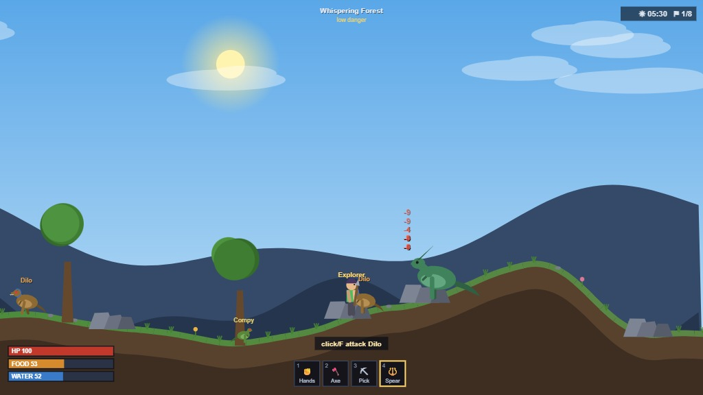

# SideScroller — an ARK-inspired 2D multiplayer survival game

A browser-based, 2D side-scrolling survival game in the spirit of **ARK: Survival Evolved**.
Up to 8 players share one persistent world: punch trees, mine stone, craft tools,
build a thatch hut, light a campfire, cook food — and eventually tame dinosaurs.

No install needed — players just open a web page.



*Daytime in the Rocky Highlands: rolling terrain, a wild Parasaur, roaming dodos,
and the survival HUD. All art and sound are generated at runtime — no asset files.*

## Running the server

**Windows:** double-click **`start-server.bat`**. On first run it installs
dependencies automatically, then launches the server and prints the URLs.

**Any platform (or from a terminal):**

```
npm install
npm start
```

Then open `http://localhost:3000` in a browser. Other players on the same
network connect to `http://<your-LAN-IP>:3000` (the server prints these on start).
Close the window or press Ctrl+C to stop it.

## Tech

- **Server**: Node.js + `ws` (WebSockets). Authoritative for inventory, harvesting,
  crafting, building, taming. Saves world state to `data/save.json` periodically.
- **Client**: Vanilla JS + Canvas 2D, ES modules. All art is drawn procedurally
  (no binary assets). Client predicts its own movement; other entities are
  interpolated from server snapshots.
- **Shared**: item/recipe/structure definitions live in `shared/` and are imported
  by both server and client.

## Design notes

- Resource nodes (trees, stone piles, berry bushes, metal veins) respawn a few
  minutes after being depleted, ARK-style — and each night, any chunk of the
  island with no players nearby is wiped and re-rolled: fresh nodes, fresh dinos.
- Tool affinity and tiers matter: hands pull thatch, axes chop wood, picks mine
  stone/flint/ore — and metal tools harvest 1.7x. Fists < stone < spear < metal
  sword < rifle for damage.
- The island is five regions of rising danger: the safe Spawn Meadow hub,
  Whispering Forest, Rocky Highlands, Deep Wilds, and the Scorched Badlands.
  Portals at the hub jump you to each region's entrance; return portals bring
  you home — so one central base, exploring outward.
- Terrain rolls: hills to jump up, valleys, and streams to drink from (watch
  the thirst bar; berries help too).
- Dinos: dodos and parasaurs are tameable with berries (parasaurs are
  rideable — press R). Compys and dilos are small but aggressive; raptors will
  shred anyone not in a full metal armor set; the T-Rex is best avoided until
  you've built a rifle.
- **Tames guard you**: a following pet intercepts any hostile that closes in —
  war dodos peck compys to death, a parasaur's tail can fight off a lone
  raptor — and you loot whatever your bodyguard kills. Hostiles fight back
  (pets can die protecting you), pets slowly mend afterward, and a pet told
  to stay (T) holds its post instead.
- Metal tier: forge smelts ore into ingots (charcoal byproduct) → metal tools,
  a full armor set (up to 78% damage reduction), gunpowder, bullets, rifle.
- All sound is generated at runtime with WebAudio — no audio files. M mutes.
- ESC opens options: toggle hunger/thirst/dino damage, day length, AI survivor
  count, quit — and **rebind every key** (click the key, press the new one;
  saved per browser, Esc stays fixed, arrows/W/Tab remain built-in extras).
- **AI survivors** share the island: computer players (Helena, Rockwell,
  Mei Yin, Santiago) who gather, craft, build their own camps, hunt, tame
  dodos, and push toward metal — dying and rebuilding just like everyone else.
  They eat, drink from streams, flee raptors, camp by their fires at night,
  and their progress persists in the world save.
- **Raid the AI camps**: bots haul their surplus home into their storage
  boxes — open one and rob the stash, or tear their camp down entirely
  (bot structures are demolishable; player bases stay protected). They'll
  grumble in chat and start rebuilding from scratch.

## Roadmap

- [x] Stage 1: movement, gathering, crafting, building, campfire, hunger/food
- [x] Stage 2: dodos — hunting and passive taming
- [x] Expansion: terrain/streams, combat roster (compy/dilo/parasaur/raptor/rex),
      portals + region hub, night re-randomization, metal tier + rifle,
      thirst, ESC options, procedural sound
- [x] AI survivors: computer players that progress through the same tech tree
- [ ] Later: saddles + more mounts, ranged dinos, boss arenas, map gating tiers,
      bots using portals / rifles / armor
